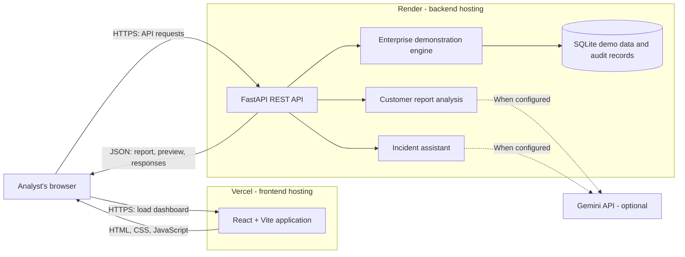
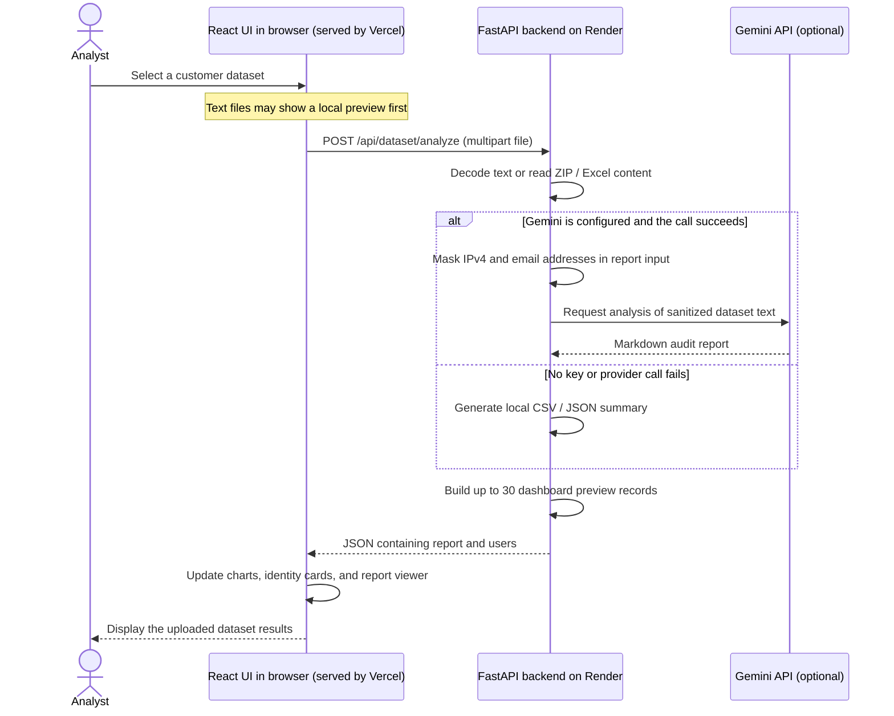
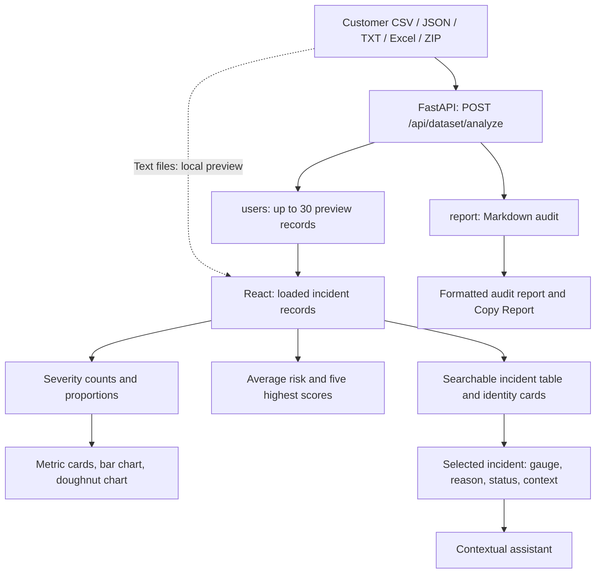
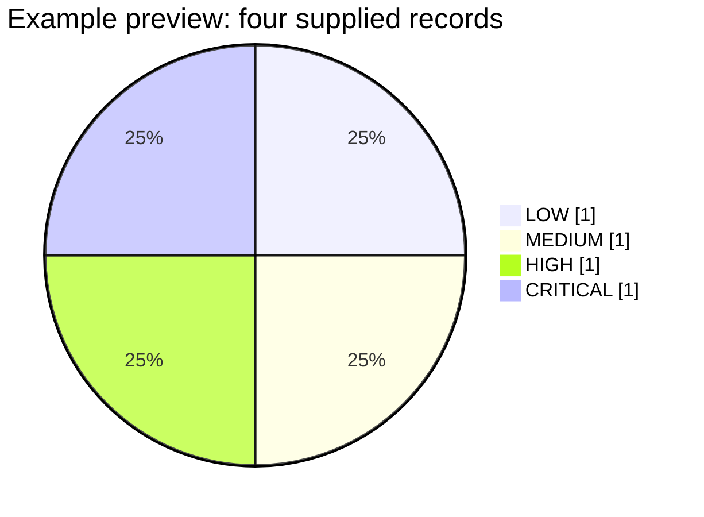

# VectrGuard — Explainable Insider-Threat Anomaly Detector

**Hack the Horizon · HTH-CS-07 · THE ALGORITHMISTS**

**Live dashboard:** [Open VectrGuard](https://vectrguard-dashboard.vercel.app/)

**Hosted on:** Vercel for the React frontend · Render for the FastAPI backend.

VectrGuard is a security operations dashboard built with **React and FastAPI**. Analysts can upload customer telemetry, read a security audit report, inspect identity risk and policy states, and ask an assistant about a selected incident.

This README describes the implementation on **`main`**. The backend entry point is [`backend/server.py`](backend/server.py); Streamlit is no longer required.

**Quick navigation:** [Cloud deployment](#cloud-deployment-vercel--render) · [Local setup](#run-locally) · [Dataset formats](#customer-dataset-format-and-outputs) · [Data visualizations](#data-visualization-guide) · [Gemini configuration](#gemini-and-audit-configuration) · [API reference](#rest-api-reference) · [Verification](#build-and-verification)

## Features

- Customer uploads through CSV, JSON, text, Excel, or ZIP files.
- Markdown audit reports from Gemini when configured, with a local statistical fallback.
- A dashboard and identity directory populated from the uploaded data preview.
- Incident details, risk indicators, access status, and contextual assistant responses.
- A separate SQLite-backed demonstration engine with behavioral baselines, 30-day drift, explainable assessments, a three-slot investigation queue, OTP simulation, and audit history.
- IPv4/email masking before customer dataset text is sent to Gemini, and encryption of audit rationales written through the audit helper.

## Tech stack and repository layout

| Layer | Technologies |
|---|---|
| Frontend | React 18, Vite, Tailwind CSS, Framer Motion, Recharts, Axios |
| Reports | React Markdown and remark-gfm |
| Backend | Python, FastAPI, Pydantic, Uvicorn |
| Data | SQLite, pandas, openpyxl |
| AI | Google Gen AI SDK; optional Gemini integration |
| Audit encryption | cryptography / Fernet |

```text
HTH006CS01/
├── backend/
│   ├── server.py                  # FastAPI routes and upload handling
│   ├── requirements.txt
│   ├── src/
│   │   ├── customer_analysis.py   # Customer report generation and fallback
│   │   ├── cert_engine.py         # SQLite ingestion, policy state, OTP, audit
│   │   ├── baselining.py          # User and department behavior profiles
│   │   ├── threat_detector.py     # Structured UEBA assessments
│   │   ├── prioritizer.py         # Capacity-constrained queue
│   │   └── crypto_utils.py        # Audit rationale encryption
│   ├── insider_threat_data/       # Bundled enterprise demonstration CSVs
│   └── tests/test_verification.py # Dataset verification script
├── frontend/
│   ├── src/App.jsx               # Dashboard state and incident investigation
│   ├── src/api.js                # Axios API configuration
│   ├── src/components/           # Upload, assistant, verification, UI
│   ├── src/views/                # Dashboard and identity directory
│   └── package.json
└── README.md
```

## Cloud deployment: Vercel + Render

The project frontend is deployed on **Vercel**, and the Python FastAPI backend is deployed on **Render**. Open the Vercel dashboard to use the application; the frontend's Axios client connects to the backend URL configured through `VITE_API_URL`.

| Component | Hosting | Responsibility | Address / configuration |
|---|---|---|---|
| React + Vite frontend | **Vercel** | Serves the dashboard application, upload interface, charts, report viewer, and assistant UI. | [vectrguard-dashboard.vercel.app](https://vectrguard-dashboard.vercel.app/) |
| FastAPI backend | **Render** | Processes uploaded datasets, generates reports, handles assistant requests, and exposes enterprise/demo API routes. | Render service origin followed by `/api`, configured as `VITE_API_URL` on Vercel. |
| Gemini integration | External service called by the backend | Optional report generation and contextual assistant responses. | `GEMINI_API_KEY` stays in the Render backend environment. |

### Deployment architecture graph



Vercel serves the frontend assets. API calls originate from the browser and go to the configured Render backend. Customer uploads follow the report-analysis path; they are not automatically inserted into the separate enterprise SQLite database. The diagram shows application responsibilities, not a claim of persistent cloud storage or live infrastructure monitoring.

### Upload-to-report sequence graph



Incident chat follows the same browser-to-Render connection through `POST /api/ai/chat`. The frontend sends the selected incident context and question; the backend returns a response using Gemini or its local template fallback. Chat and customer reporting have different masking behavior, as described in [Gemini and audit configuration](#gemini-and-audit-configuration).

### Frontend-to-backend connection

Set `VITE_API_URL` in the Vercel frontend environment to the deployed Render API base, including `/api`:

```dotenv
# Template only: replace <your-render-service> with the actual Render hostname.
VITE_API_URL=https://<your-render-service>.onrender.com/api
```

This is a configuration template, not the project's verified backend URL. Vite includes this value when building the frontend, so changing it requires a new frontend build/deployment. The code otherwise falls back to `http://localhost:8000/api`, which points to the visitor's own computer when used from a deployed browser.

The backend exposes `/api/health` for API reachability, `/docs` for interactive documentation, and `/openapi.json` for its schema on the Render service origin. The dashboard polls the health endpoint every five seconds; this checks connectivity rather than streaming fresh security events. Keep `GEMINI_API_KEY` and the persistent `AUDIT_ENCRYPTION_KEY` in the backend environment, not in `VITE_*` variables.

## Run locally

Use Python 3.11+ and a current Node.js LTS release with npm. Run the backend and frontend in separate terminals.

```bash
git clone --branch main https://github.com/Tarunika-Muruganathan/HTH006CS01.git
cd HTH006CS01
```

### 1. Start FastAPI

```bash
cd backend
python -m venv .venv
source .venv/bin/activate
python -m pip install -r requirements.txt
python -m uvicorn server:app --host 127.0.0.1 --port 8000 --reload
```

On Windows PowerShell, activate with `.\.venv\Scripts\Activate.ps1` instead of `source .venv/bin/activate`.

| Service | Local URL |
|---|---|
| API | <http://localhost:8000> |
| Interactive API documentation | <http://localhost:8000/docs> |
| OpenAPI schema | <http://localhost:8000/openapi.json> |
| Health check | <http://localhost:8000/api/health> |

`python server.py` is also supported from `backend/`; its development entry point binds to `0.0.0.0:8000` with reload enabled.

### 2. Start React

From the repository root in a second terminal:

```bash
cd frontend
npm ci
npm run dev
```

Open <http://localhost:5173>. The client defaults to `http://localhost:8000/api`.

To use another backend, put its public URL in `frontend/.env.local`, then restart Vite:

```dotenv
VITE_API_URL=http://localhost:8000/api
```

Include the `/api` suffix. Keep Gemini keys on the server: Vite environment values are included in the browser bundle.

### 3. Upload and investigate

1. Click **Select Dataset** and choose a supported file.
2. The frontend sends it to `POST /api/dataset/analyze` as multipart form data.
3. Open the generated report and inspect identities in the dashboard or directory.
4. Select an incident to inspect its details and use the contextual AI assistant.

The dashboard starts empty. Bundled enterprise data is not automatically ingested on server startup.

## Customer dataset format and outputs

### Supported inputs

| Input | Current handling |
|---|---|
| `.csv` | Header-based telemetry records; use a consistent schema. |
| `.json` | An array of objects is the most compatible form for both reports and the dashboard preview. |
| `.txt` | Read as text; the offline report expects CSV or JSON content. |
| `.xlsx` | Converted to CSV with pandas and openpyxl; the default worksheet is read. |
| `.xls` | Accepted by the UI, but legacy Excel requires an additional reader such as `xlrd`, absent from the current requirements. Prefer `.xlsx`. |
| `.zip` | Recognized CSV/JSON/TXT/Excel members are read in memory and concatenated; declared uncompressed size is limited to 500 MiB. |

Use explicit risk scores and levels for a consistent dashboard preview. Save this example as `customer_logs.csv`:

```csv
user_id,name,department,timestamp,risk_score,level,status,primary_reason
EMP101,Analyst A,Engineering,2026-01-05T10:00:00Z,18,LOW,APPROVED,Activity within expected hours
EMP205,Analyst B,Finance,2026-01-05T22:30:00Z,54,MEDIUM,VERIFYING,Unusual login location
EMP302,Analyst C,Research,2026-01-05T23:00:00Z,84,HIGH,FROZEN,Restricted file access after hours
EMP928,Analyst D,Operations,2026-01-05T23:30:00Z,98,CRITICAL,BLOCKED,Large external data transfer
```

These are illustrative **input scores**, not expected predictions from raw logs. Useful optional fields include `location` and `last_seen`. The backend preview also recognizes aliases including `userId`, `user_name`, `dept`, `score`, `risk_level`, and `reason`.

### Upload API example

```bash
curl -X POST http://localhost:8000/api/dataset/analyze \
  -F "file=@customer_logs.csv"
```

The response is a JSON object containing:

| Field | Meaning |
|---|---|
| `report` | Markdown audit report, rendered in the UI with a copy-to-clipboard action. |
| `users` | Up to 30 preview records normalized for the dashboard. |

The local report summarizes record count, distinct identities, departments, supplied risk scores, and up to 15 elevated-risk records. It does not run the full baseline detector on arbitrary uploaded logs. If usable numeric scores are absent, an absence of flagged records is not evidence that the dataset is safe.

### Dataset isolation and persistence

Customer report generation receives only the current upload text. The upload endpoint does not ingest the file into the enterprise SQLite database or retrain its baselines. A successful new upload replaces the frontend preview; it does not create persistent, selectable dataset history. Refreshing the page clears that preview.

ZIP members are concatenated rather than joined as relational tables. Mixed CSV headers or multiple JSON documents may therefore produce an incomplete offline report or preview. For consistent results, upload one normalized CSV/JSON dataset. The SQLite user, baseline, and queue endpoints are a separate demonstration workflow and do not automatically reflect customer uploads.

## Data visualization guide

The dashboard turns the currently loaded preview records into severity counts, proportions, average risk, and identity-level comparisons. Recharts renders the bar, doughnut, and activity charts; the risk gauge uses SVG, while Framer Motion animates gauges, progress bars, cards, and investigation panels.

### From an uploaded file to the dashboard



The report and visual preview have different scopes. The report may summarize more records than the dashboard, whose successful backend preview is limited to 30 rows. Repeated `user_id` values are not deduplicated by the dashboard: its counts describe **loaded records**, even where the UI labels them “identities.”

### What each visualization means

| Visualization | Data and calculation | How to read it |
|---|---|---|
| Four severity cards | Counts records whose supplied `level` is LOW, MEDIUM, HIGH, or CRITICAL; shows each count and rounded share of all loaded records. | Start here to see the size of each severity group. The cards count levels, even though their titles also mention approval, verification, freezing, or blocking. |
| **Risk distribution** bar chart | X-axis: four severity levels. Y-axis: number of loaded records in each level. Hover tooltips expose the values. | Compare absolute group sizes; a taller bar means more records in that category. |
| **Level proportions** doughnut chart | Uses the same severity counts and labels slices with rounded percentages of the recognized categories. | Compare the relative composition of the preview. A percentage is a share of records, not a probability of an attack. |
| **Avg risk** circular gauge | Rounded arithmetic mean of loaded `risk_score` values. The SVG arc represents the value on a 0–100 scale. | Summarizes the preview, but a low mean can coexist with a few high-scoring records. Check the highest-risk list too. |
| **Current posture** badge | ELEVATED when any record is CRITICAL; otherwise GUARDED when any is HIGH; otherwise NORMAL. | A quick label derived from the loaded severity categories, not a separate threat model. |
| **Highest risk** list | Sorts a copy of the loaded records by numeric score, descending, and shows up to five. | Identifies records to inspect first. This list is separate from the backend's capacity-constrained investigation queue. |
| Incident table score bars | Bar length is the row's score, clamped visually to 0–100; adjacent badges show `level` and `status`. | Compare individual records and open **Investigate** to read the selected record's reason and context. |
| Identity directory cards | Show each record's identity, department, location, score bar, severity, and status. | Search by user ID, name, department, or location to find a particular identity. |
| Investigation drawer | Selected record's circular score gauge, severity/status badges, last-seen label, primary reason, and policy text. | Review the explanation alongside the score. The expandable evidence section currently uses record fields and template text, not a fetched factor-attribution chart. |

The identity directory also shows **Total monitored**, **High / critical risk** (numeric score at least 70), and **Awaiting verification** (`status = VERIFYING`). These summaries use all loaded records, independently of the directory search.

### Color and status legend

| Level | Cards, badges, and score bars | Bar/doughnut chart color | Typical status label |
|---|---|---|---|
| LOW | Emerald / green | Sky blue (`#38bdf8`) | APPROVED |
| MEDIUM | Amber / yellow | Amber (`#fbbf24`) | VERIFYING |
| HIGH | Orange | Orange (`#f97316`) | FROZEN |
| CRITICAL | Rose / red | Rose (`#f43f5e`) | BLOCKED |

Read the numeric score and text labels as well as the colors. Severity (`level`) and access state (`status`) are separate fields and can differ in uploaded data. A risk score displayed out of 100 is not a calibrated confidence percentage.

There is currently a boundary mismatch between components: the circular gauge changes color at **30, 70, and 95**, dashboard policy cards display **0–30 / 31–69 / 70–94 / 95–100**, and the structured backend assessment uses **0–30 / 31–70 / 71–95 / 96–100**. Uploaded level labels drive the category charts. This README documents the existing behavior rather than implying that all visual thresholds are already unified.

### Worked example: the four-record CSV above

With one record in each supplied severity category, the displayed distribution is:



This is an illustration calculated from the sample CSV, not a screenshot or a live production chart. Its expected dashboard values are:

| Measure | Expected value |
|---|---|
| Loaded records | 4 |
| LOW / MEDIUM / HIGH / CRITICAL | 1 each; 25% each |
| Average risk | `round((18 + 54 + 84 + 98) / 4) = 64` |
| High plus critical records | 2, representing 50% of this preview |
| Current posture | ELEVATED, because a CRITICAL record is present |
| Highest-risk ordering | EMP928 → EMP302 → EMP205 → EMP101 |
| Awaiting verification | 1, from EMP205's supplied VERIFYING status |

The dashboard calculations are:

```text
count(level) = number of loaded records with that level
card share  = round(100 × count(level) / loaded record count)
average risk = round(sum(loaded risk scores) / loaded record count)
```

Use the four supported level names consistently. Unrecognized labels are excluded from severity counts, while the records still affect total counts and the average. For valid labels, the doughnut shares and severity-card shares describe the same distribution, subject to rounding.

### Which panels are based on data, and which are demonstrations?

| Panel | Current source | Interpretation |
|---|---|---|
| Severity cards, risk bar/doughnut charts, score gauges, highest-risk list | Loaded preview fields and frontend calculations. | These reflect the current preview, including any supplied scores or parser defaults. |
| **24-Hour activity stream** | `generateTimelineData()` creates random hourly values influenced by the number of loaded records. | A demonstration chart. Its cyan events, amber anomalies, and rose dashed blocked series do not aggregate uploaded timestamps. |
| **Live event feed** | The first eight preview records, with generated timestamps and cycling event types. | User IDs/reasons come from preview rows; event times and categories are illustrative. |
| MITRE ATT&CK heatstrip | Random tactic hit counts and active flags. | A presentation element, not measured technique coverage for the upload. |
| System health tiles | Static labels and a generated event-rate value of `loaded record count × 47`. | These are not backend throughput or model-health measurements. |
| API connection and last-sync indicator | A request to `/api/health` every five seconds. | Confirms API reachability; it does not refresh uploaded records or stream new telemetry. |

The colored distribution strip in the decision panel assigns every category a minimum visible width of 3%, including zero-count categories. Use the numeric cards and bar/doughnut tooltips for exact quantities.

The backend exposes `/api/users/{uid}/drift` and `/api/users/{uid}/stats`, but the current customer dashboard does not request them to populate these panels. Its 24-hour demo chart should not be read as the SQLite engine's 30-day drift history.

### Suggested analyst walkthrough

1. Upload the four-record example and confirm the counts and average shown above.
2. Compare the bar chart's absolute counts with the doughnut chart's percentages.
3. Use **Highest risk** to identify the largest score, then locate that record in the incident table.
4. Apply a severity filter or search by user ID/name. These controls affect the **table only**; summary cards and charts continue to describe the entire loaded preview.
5. Open **Investigate**, read `primary_reason`, compare score/level/status, and expand the explanation. Use the assistant for questions about that selected context.
6. Review the audit report for its broader summary. A report's total-record count can exceed the preview count shown in the dashboard.

### Visualization source files

| File | Responsibility |
|---|---|
| [`DashboardView.jsx`](frontend/src/views/DashboardView.jsx) | Severity aggregation, charts, posture, highest-risk list, filtering, and demo activity/MITRE panels. |
| [`MetricCard.jsx`](frontend/src/components/MetricCard.jsx) | Category totals, percentages, and animated share bars. |
| [`RiskGauge.jsx`](frontend/src/components/RiskGauge.jsx) | Circular SVG score gauge and score-based color thresholds. |
| [`RiskBadge.jsx`](frontend/src/components/RiskBadge.jsx) / [`StatusBadge.jsx`](frontend/src/components/StatusBadge.jsx) | Severity and access-state text/color encoding. |
| [`UsersView.jsx`](frontend/src/views/UsersView.jsx) | Searchable identity cards and directory summary metrics. |
| [`DatasetUpload.jsx`](frontend/src/components/DatasetUpload.jsx) | File parsing, preview loading, report request, and Markdown report viewer. |
| [`App.jsx`](frontend/src/App.jsx) | Shared loaded-record state, incident drawer, API health polling, and assistant context. |

## Gemini and audit configuration

| Variable | Purpose |
|---|---|
| `GEMINI_API_KEY` | Optional server-side key for customer reports, incident chat, and UEBA assessments. |
| `AUDIT_ENCRYPTION_KEY` | Optional persistent Fernet key for audit rationales. Otherwise, the backend creates/uses `backend/.audit_encryption.key`. |
| `VITE_API_URL` | Frontend API base URL; defaults to `http://localhost:8000/api`. |

The FastAPI entry point calls `load_dotenv()` and reads process environment variables. For local development, you can keep server settings in `backend/.env`; on Render, configure them in the service environment. You can also set the Gemini key in the same terminal before starting the server:

```bash
export GEMINI_API_KEY="your-server-side-key"
```

PowerShell equivalent: `$env:GEMINI_API_KEY="your-server-side-key"`.

The current model is `gemini-2.5-flash`, specified in the Python code. Without a key, customer reports use the local CSV/JSON summary and chat uses templated incident-context responses. Provider errors also trigger these fallbacks.

Customer analysis masks IPv4 addresses and email addresses before sending at most the first **50,000 characters** of sanitized dataset text to Gemini. Its prompt requests dataset-grounded findings, peer comparisons, feature attribution, and a confidence statement. These are model-generated explanations; the code does not calculate formal SHAP values or calibrated confidence probabilities.

Chat sends the question and frontend-supplied incident context. Current guardrails are prompt-based: responses are not independently validated against stored evidence. Customer-report masking does not also run on chat context, and other identifiers may remain in uploaded content.

Audit helpers encrypt the `rationale` field, not the entire SQLite database. Keep the same encryption key across restarts and backups; keep `backend/.audit_encryption.key` private and out of commits.

## REST API reference

These routes are implemented in `backend/server.py`. Request schemas are available at `/docs`.

| Method | Route | Output / purpose |
|---|---|---|
| GET | `/` | Service name and version. |
| GET | `/api/health` | Backend availability. |
| POST | `/api/dataset/analyze` | Multipart `file`; returns `{report, users}`. |
| POST | `/api/ai/chat` | JSON `message` and optional `incident_context`; returns `{response}`. |
| GET | `/api/alerts` | Selected enterprise identity alerts. |
| GET | `/api/users` | Enterprise users and policy state. |
| GET | `/api/users/{uid}/logs` | User telemetry from SQLite. |
| GET | `/api/users/{uid}/baseline` | Historical behavior profile. |
| GET | `/api/users/{uid}/observed` | Recent observed behavior. |
| GET | `/api/users/{uid}/drift` | Longitudinal drift data. |
| GET | `/api/users/{uid}/analyze` | Structured assessment; may update cached assessment/policy data. |
| GET | `/api/users/{uid}/stats` | Event counts and hourly/daily activity. |
| GET | `/api/queue` | Active investigation slots and deferred backlog. |
| POST | `/api/simulation/inject/{scenario_type}` | Preset incident: `normal`, `medium`, `high`, or `critical`. |
| POST | `/api/verification/verify` | JSON `user_id` and `otp`; demo step-up verification. |
| GET | `/api/audit` | Audit history; optional `user_id` and `limit`. |
| POST | `/api/audit` | `user_id`, `actor`, `action`, `status`, `justification`; optional `ai_override`. |

Enterprise routes need initialized SQLite tables. They are not an API for the transient customer preview. Routes from the original project brief such as `/api/dashboard/stats`, `/api/incidents`, `/api/investigation/capacity`, and `/api/verification/challenge` are not implemented on this branch.

## Enterprise demonstration engine

The bundled dataset contains 2,500 identities and 180 days of synthetic activity. Its CSVs include user profiles, resources, logon/file/device events, HR events, and scenario labels.

Initialize the demonstration database from `backend/`:

```bash
python -m src.cert_engine --ingest
```

This command **clears and reloads existing enterprise data and policy tables** in `backend/insider_threat_data/cert_v2.db`. Use disposable demonstration data. It is not required for customer report uploads.

### Policy tiers

The structured UEBA assessment model uses these ranges:

| Score | Tier | Decision |
|---|---|---|
| 0–30 | LOW | Access approved |
| 31–70 | MEDIUM | Verification required |
| 71–95 | HIGH | Account temporarily frozen |
| 96–100 | CRITICAL | Session blocked and account locked |

Assessment output includes `risk_score`, `risk_level`, `action_decision`, factors with baseline/observed values, a plain-English explanation, MITRE mappings, and a recommended containment step. The engine adjusts factor points to match the resulting score. Its local enterprise fallback uses bundled scenario labels and seeded pseudo-random scoring; it is not an independently validated detector for unseen customer data.

The customer-report fallback uses separate thresholds: it flags scores of 70 or more and infers missing levels at 40/70/90. Supplied preview levels are accepted directly. These paths are not yet unified with the structured assessment policy above.

### Investigation queue

`backend/src/prioritizer.py` sets `INVESTIGATOR_CAPACITY = 3` and uses:

```text
priority_rank = 0.7 × risk_score + 0.3 × normalized_egress_volume_score
```

Output includes `capacity_limit`, `active_occupied`, `available_slots`, `active_investigation_slots`, and `deferred_backlog` with deferral reasons. Capacity is a code constant. The current `/api/queue` route passes cached risk scores but omits egress measurements, so the egress component uses its default value.

### Demo verification and deployment boundary

OTP verification includes a fixed `123456` demonstration bypass. Access states and containment recommendations are application/demo behavior; the repository does not integrate a real identity provider or endpoint enforcement service. The API currently has no authentication layer and uses wildcard CORS. The published Vercel/Render application is a hackathon demonstration; production use requires replacing those demo controls.

## Build and verification

Build the frontend from `frontend/`:

```bash
npm ci
npm run build
npm run preview
```

Run the existing enterprise verification script from `backend/`:

```bash
python tests/test_verification.py
```

The script re-ingests the bundled dataset and modifies demo policy/audit state. It exercises scenario assessments, factor totals, queue capacity, OTP behavior, and drift. Use a disposable database and leave `GEMINI_API_KEY` unset to exercise the local fallback. These scenario checks do not establish detection accuracy on independent customer datasets.

## Troubleshooting

| Symptom | Check |
|---|---|
| Local dashboard says API offline | Confirm FastAPI is on port 8000 and `VITE_API_URL` includes `/api`; restart Vite after changing its environment. |
| Vercel dashboard says API offline | Check the Render service's `/api/health`, set Vercel's `VITE_API_URL` to the Render HTTPS origin plus `/api`, and rebuild/redeploy the frontend after changing that value. |
| No identities on first load | Expected: select a customer dataset. Bundled data is not automatically loaded into the UI. |
| Preview appears but no report | A text file may have been parsed locally even if the backend request failed. Check the API connection and server output. |
| SQLite “no such table” on enterprise routes | Initialize the optional demo database with `python -m src.cert_engine --ingest`. |
| Excel import fails | Prefer `.xlsx` and install `backend/requirements.txt`; `.xls` needs another reader engine. |
| ZIP report or preview is incomplete | Normalize the logs into one CSV/JSON file with a consistent schema. |
| Gemini falls back to a local report | Check the server environment, API key/model access, and provider errors in server output. |
